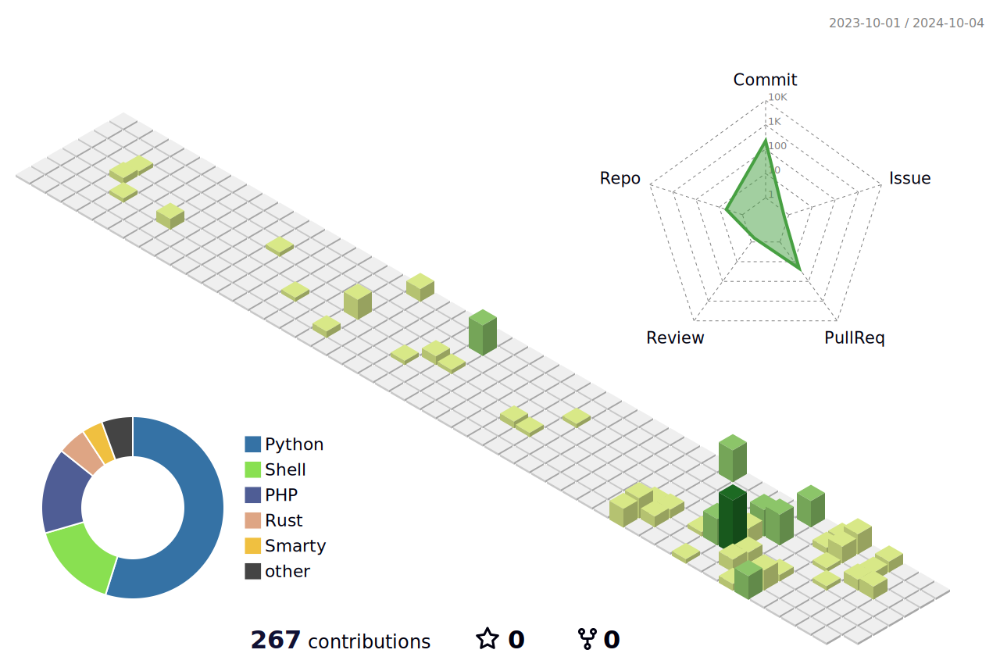

[//]: # (![Hello there]&#40;./hello_there.gif&#41;)

# Hi there, I'm Aleksander! 👋

## About Me

I'm a passionate DevOps Engineer with experience in automating and streamlining processes, implementing CI/CD pipelines, and managing cloud infrastructure. I enjoy working with cutting-edge technologies and continuously improving my skills.

## 🚀 Technology Stack

### Configuration Management
- **Ansible**: Automate your configuration management, application deployment, and task automation with Ansible.

### Container Orchestration
- **OpenShift**: Manage containerized applications with OpenShift, the enterprise Kubernetes platform.
- **Kubernetes**: Orchestrate containers with Kubernetes, the leading open-source container orchestration platform.

### Helm
- **Helm**: Manage Kubernetes applications with Helm, the package manager for Kubernetes.

### Continuous Deployment
- **ArgoCD**: Implement GitOps for Kubernetes with ArgoCD, a declarative, GitOps continuous delivery tool for Kubernetes.

### CI/CD Pipelines
- **Pipelines**: Automate your build, test, and deployment processes with CI/CD pipelines.

## 📫 How to reach me

- **LinkedIn**: [My LinkedIn](https://www.linkedin.com/in/aleksander124/)

## 🛠️ Tools & Technologies

  
  
  
  
  
  
  

## GitHub Stats

  
  

  

